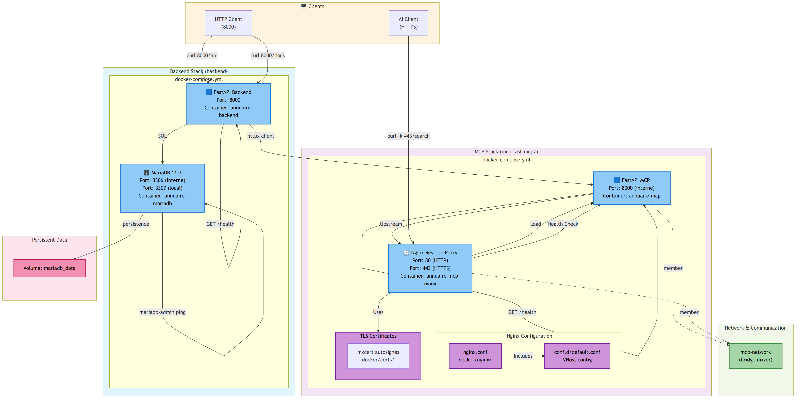

# Architecture Diagram — annuaire-contacts

## Visual Overview



*Diagramme généré avec Mermaid (voir [`ARCHITECTURE.mmd`](./ARCHITECTURE.mmd))*

---

## Components

### 🖥️ Clients

#### HTTP Client
- **Accès:** `curl http://localhost:8000/...`
- **Usage:** Tests locaux, requêtes directes API
- **Endpoints:** `/contacts`, `/docs`, `/health`

#### AI Client
- **Accès:** `curl -k https://localhost/...`
- **Usage:** Agents IA, intégration Claude
- **Endpoints:** `/search`, `/summary`, `/suggestions`, `/health`
- **Note:** HTTPS via Nginx avec certificat autosigné

---

### 🟦 Backend Stack

Located in: `backend-fastapi/`

#### FastAPI Backend
- **Container:** `annuaire-backend`
- **Port:** `8000` (local & interne)
- **Role:** CRUD API REST pour contacts
- **Endpoints:**
  - `POST /contacts` — Créer
  - `GET /contacts` — Lister
  - `GET /contacts/{id}` — Détails
  - `PUT /contacts/{id}` — Mettre à jour
  - `DELETE /contacts/{id}` — Supprimer
  - `GET /contacts/search/{query}` — Chercher
  - `GET /health` — Health check
  - `GET /docs` — Swagger UI

#### MariaDB 11.2
- **Container:** `annuaire-mariadb`
- **Port:** `3306` (interne) ↔ `3307` (local mapping)
- **Database:** `annuaire_contacts`
- **User:** `annuaire_user`
- **Persistence:** Volume `mariadb_data`
- **Healthcheck:** `mariadb-admin ping`

#### Connection
- **FastAPI → MariaDB:** SQL queries via SQLAlchemy
- **Type:** Internal, sauf mapping 3307 pour dev/debugging

---

### 🟦 MCP Stack

Located in: `mcp-fast-mcp/`

#### FastAPI MCP Application
- **Container:** `annuaire-mcp`
- **Port:** `8000` (interne seulement)
- **Role:** Wrapper IA / MCP Server
- **Endpoints:**
  - `POST /search` — Chercher contacts (structuré pour IA)
  - `POST /summary` — Résumé d'un contact
  - `POST /suggestions` — Autocomplete noms
  - `GET /contacts` — Lister (contexte IA)
  - `GET /health` — Health check

#### Nginx Reverse Proxy
- **Container:** `annuaire-mcp-nginx`
- **Ports:** `80` (HTTP), `443` (HTTPS)
- **Role:** Expose MCP en public, TLS termination
- **Configuration:**
  - `docker/nginx/nginx.conf` — Config globale
  - `docker/nginx/conf.d/default.conf` — VHost annuaire-mcp
  - Hostname: `annuaire-mcp.local.docker.dev`

#### TLS Certificates
- **Location:** `docker/certs/`
- **Type:** Autosignés (mkcert)
- **Files:**
  - `annuaire-mcp.local.docker.dev.pem` — Certificate
  - `annuaire-mcp.local.docker.dev-key.pem` — Private key
- **Note:** Dev-only, remplacer en production par Let's Encrypt

#### Connection (MCP → Backend)
- **Client:** `backend_client.py` (httpx async)
- **Target:** `http://localhost:8000` (BACKEND_URL env var)
- **Usage:** Appels internes pour CRUD contacts

---

## 🌐 Network & Communication

### Docker Networks

#### mcp-network (bridge)
- **Type:** Bridge driver
- **Members:**
  - Service `annuaire-mcp`
  - Service `nginx`
- **Purpose:** Communication intra-compose entre MCP et Nginx

#### Backend Network
- Services `backend`, `mariadb` dans docker-compose.yml du backend
- Communication interne standard Docker

---

## 💾 Persistent Data

### Volumes

#### mariadb_data
- **Location:** Docker managed volume
- **Mounted to:** `/var/lib/mysql` (MariaDB container)
- **Persistence:** Survit aux `docker compose down`
- **Usage:** Sauvegarde données contacts

---

## 🔄 Communication Flows

### Flow 1: HTTP Client → Backend API

```
HTTP Client (port 8000)
  ↓
FastAPI Backend
  ↓
MariaDB
  ↓
Response (JSON Contact)
```

**Example:**
```bash
curl -X POST http://localhost:8000/contacts \
  -H "Content-Type: application/json" \
  -d '{"nom":"Alice","email":"alice@example.com"}'
```

---

### Flow 2: AI Client → MCP → Backend

```
AI Client (HTTPS port 443)
  ↓
Nginx Reverse Proxy
  ↓
FastAPI MCP (8000 internal)
  ↓
httpx async client
  ↓
FastAPI Backend (8000)
  ↓
MariaDB
  ↓
Structured Response (IA-friendly)
```

**Example:**
```bash
curl -k -X POST https://localhost/search \
  -H "Content-Type: application/json" \
  -d '{"query":"Alice","limit":10}'
```

---

### Flow 3: Health Checks

```
Nginx Healthcheck → MCP → /health (OK)
MariaDB Healthcheck → mariadb-admin ping (OK)
FastAPI Backend → /health endpoint (OK)
```

---

## 📊 Port Summary

| Service | Port | Type | Access | Container |
|---------|------|------|--------|-----------|
| Backend API | 8000 | HTTP | External + Internal | annuaire-backend |
| Backend Swagger | 8000 | HTTP | External | annuaire-backend |
| MariaDB | 3307 | TCP | Local only (dev) | annuaire-mariadb |
| MariaDB internal | 3306 | TCP | Intra-compose | annuaire-mariadb |
| MCP App | 8000 | HTTP | Internal only | annuaire-mcp |
| Nginx HTTP | 80 | HTTP | External | annuaire-mcp-nginx |
| Nginx HTTPS | 443 | HTTPS | External | annuaire-mcp-nginx |

---

## 🎯 Autonomy

Chaque service est autonome:

✅ **Backend**
- `docker compose up` démarrage complet (FastAPI + MariaDB)
- Pas de dépendance externe
- Peut être développé/testé indépendamment

✅ **MCP**
- `docker compose up` démarrage complet (MCP + Nginx)
- Dépend du Backend pour appels métier (BACKEND_URL)
- Peut être développé/testé indépendamment (mock backend)

✅ **Orchestrator**
- Coordinateur logique (pas d'orchestration Docker)
- Documentation + règles
- Peut superviser démarrage manuel des deux services

---

## 🔐 Security Considerations

### TLS (Nginx → Client)
- ✅ HTTPS port 443
- ❌ Certificat autosigné (dev-only)
- ⚠️ À remplacer en prod: Let's Encrypt ou CA interne

### Database Access
- ✅ Pas exposée sur la network publique
- ✅ Port 3307 mapping (localhost dev uniquement)
- ✅ Credentials dans env variables

### Backend → MCP
- ✅ Communication interne (http, intra-compose)
- ✅ Pas d'exposition directe

---

## 📐 File Structure Reference

```
annuaire-contacts/
├── orchestrator/
│   └── docs/
│       ├── ARCHITECTURE.mmd        ← Source Mermaid
│       ├── ARCHITECTURE.png        ← Image générée
│       ├── ARCHITECTURE.svg        ← SVG (scalable)
│       └── ARCHITECTURE-DIAGRAM.md ← This file
│
├── backend-fastapi/
│   ├── docker-compose.yml
│   ├── main.py
│   ├── database.py
│   └── models.py
│
└── mcp-fast-mcp/
    ├── docker-compose.yml
    ├── docker/
    │   ├── certs/               ← TLS certificates
    │   └── nginx/               ← Nginx config
    ├── main.py
    ├── backend_client.py
    └── models.py
```

---

## 🔧 Generating/Updating Diagram

**To regenerate from source:**

```bash
cd docs
mmdc -i ARCHITECTURE.mmd -o ARCHITECTURE.png
mmdc -i ARCHITECTURE.mmd -o ARCHITECTURE.svg
```

**Requirements:**
```bash
# Install mermaid-cli (if not present)
npm install -g @mermaid-js/mermaid-cli
```

---

**Last updated:** 2026-04-07
